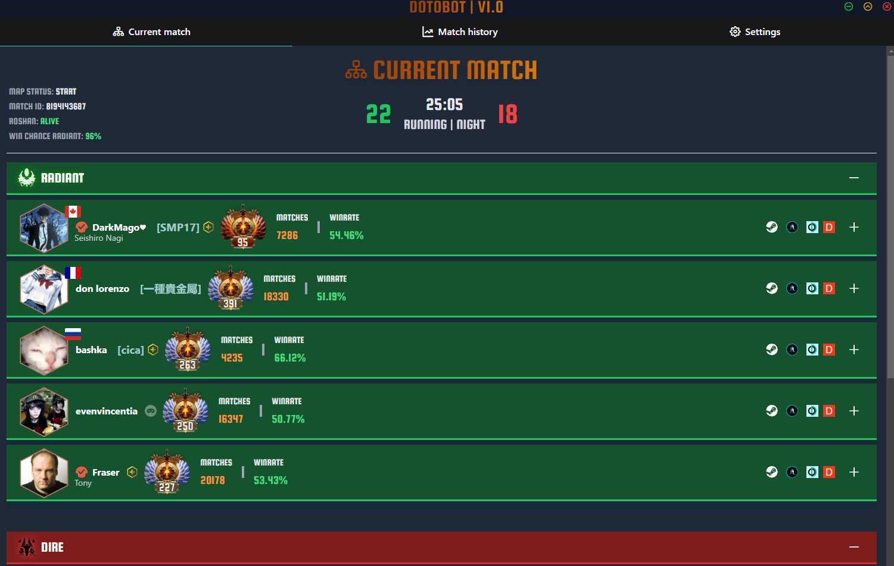

# DotaBuddy

**DotaBuddy** is an open-source project designed to enhance the Dota 2 experience by providing insightful statistics, real-time match analysis, and personalized recommendations. Our goal is to help players and streamers make better decisions and improve their gameplay using the [Stratz API](https://stratz.com) and [GraphQL](https://graphql.org).

## 🚀 Features

- **Player Statistics**: Get detailed insights into your gameplay.
- **Real-time Current Match**: Track hero information from the current match.
- **Match History**: View player match history.
- **Settings**: Customize your app settings.
- **Community-Driven**: Built for and by the Dota 2 community.

## 📸 Screenshots





## 🛠️ Installation

### Clone the repository

```bash
git clone https://github.com/GabrielCSTR/dotabuddy.git
```

### Install dependencies

```bash
npm install
```

### Development

```bash
npm run dev
```

### Build

```bash
# For Windows
npm run build:win

# For macOS
npm run build:mac

# For Linux
npm run build:linux
```

## 📂 Project Structure

```
.editorconfig
.env
.eslintignore
.eslintrc.cjs
.gitignore
.npmrc
.prettierignore
.prettierrc.yaml
dev-app-update.yml
electron-builder.yml
electron.vite.config.ts
package.json
postcss.config.js
README.md
tailwind.config.js
tsconfig.json
tsconfig.node.json
tsconfig.web.json
.vscode/
    extensions.json
    launch.json
    settings.json
build/
    entitlements.mac.plist
    icon.icns
    icon.ico
    icon.png
resources/
    icon.png
    logo.png
src/
    main/
        dota2-events.json
        dota2-gsi.ts
        ...
    preload/
        ...
    renderer/
        ...
```

### Key Files and Directories

- **src/main**: Contains the main process code for Electron, including event handlers and configurations.
- **src/preload**: Contains the preload scripts that are executed before the renderer process is loaded.
- **src/renderer**: Contains the renderer process code, including Vue components, pages, and assets.
- **build**: Contains build-related files, such as icons and entitlements.
- **resources**: Contains static resources like images and icons.
- **.vscode**: Contains VSCode-specific settings and configurations.

## 📜 Key Scripts

- **start**: Starts the Electron application in preview mode.
- **dev**: Starts the Electron application in development mode.
- **build**: Builds the Electron application for production.
- **format**: Formats the code using Prettier.
- **lint**: Lints the code using ESLint.
- **typecheck**: Runs TypeScript type checks for both Node and web configurations.

## 🔑 Environment Variables

- **RENDERER_VITE_STRATZ_KEY**: API key for Stratz integration.

## 🌐 API Integration

### Steam API

- **getPlayerSummary**: Fetches player summary from Steam API.
- **getOwnedGames**: Fetches owned games from Steam API.

### OpenDota API

- **getSteamID32**: Converts SteamID64 to SteamID32.
- **getHerosOpenDota**: Fetches hero data from OpenDota API.
- **getPorfileOpenDota**: Fetches player profile from OpenDota API.

### Stratz API

- **makeGraphQLProfileRequest**: Makes a GraphQL request to fetch player profile data from Stratz API.
- **makeGraphQLHerosRequest**: Makes a GraphQL request to fetch hero data from Stratz API.
- **makeGraphQLGetPlayerBestHeroes**: Makes a GraphQL request to fetch player's best heroes from Stratz API.

## 🎨 Styling

- **Tailwind CSS**: Used for utility-first CSS styling.
- **PrimeVue**: Used for UI components.

## 🤝 Contributing

We welcome contributions from the community! If you’d like to help improve **DotaBuddy**, follow these steps:

1. Fork the repository.
2. Create a new branch (`git checkout -b feature-name`).
3. Commit your changes (`git commit -m "Add new feature"`).
4. Push to your branch (`git push origin feature-name`).
5. Open a pull request.

Please check our [Contributing Guide](CONTRIBUTING.md) for more details.

## 🛠️ Tech Stack

- **Frontend**: Vue 3, TypeScript, Tailwind CSS
- **Other Tools**: Socket.IO, OpenDota API, Stratz API, Dota2 GSI

## 📄 License

This project is licensed under the [MIT License](LICENSE).

## 📞 Contact

Have any questions or suggestions? Feel free to reach out:

- **GitHub Issues**: [Create an issue](https://github.com/GabrielCSTR/dotabuddy/issues)
- **Email**: gabriel.developed@gmail.com
- **Discord Community**: [Join us](https://discord.gg/#)

---

🚀 **DotaBuddy** is powered by the passion of the Dota 2 community. Let's build something amazing together!

---

> Feel free to make new PR or submit any ideas.

---

## 🙏 Acknowledgment

- [Stratz](https://stratz.com/) team for providing a great GraphQL API.
- Inspired by the [DotaBuddy](https://github.com/waylaidwanderer/DotaBuddy).
